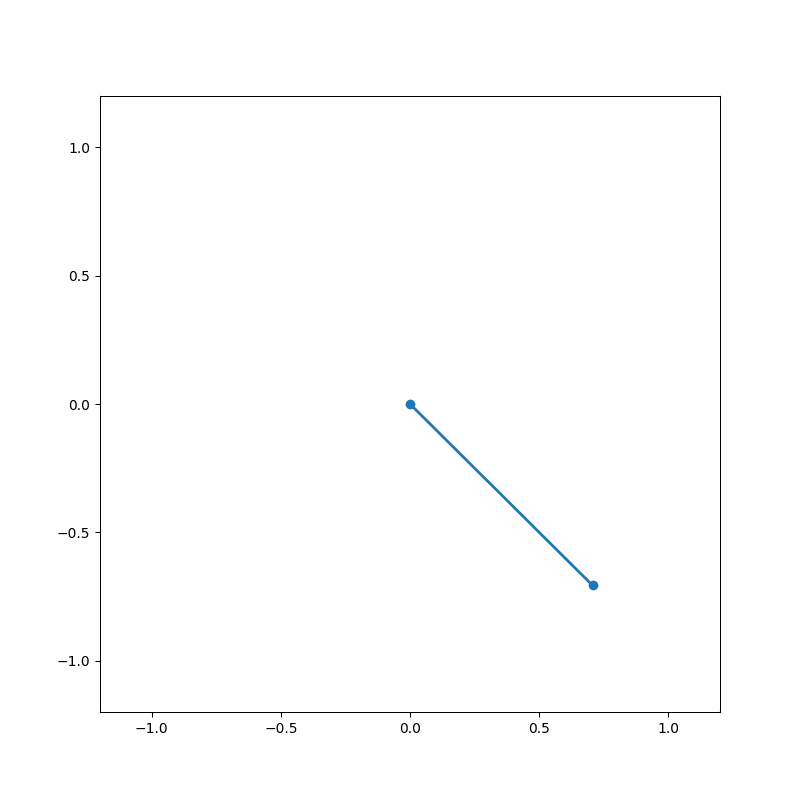

# Lagrangian Submanifolds: Computational Framework for Universal Physics

A rigorous computational implementation demonstrating how fundamental physical laws emerge naturally from symplectic geometry and Lagrangian submanifolds, bridging pure mathematics with physical reality.


## Core Components

### 1. Theoretical Foundation
- **Symplectic Manifolds**: Complete implementation of 2n-dimensional manifolds with canonical symplectic form
- **Differential Forms**: Comprehensive exterior algebra with wedge products and exterior derivatives
- **Poisson Structures**: Rigorous implementation of Poisson brackets satisfying Jacobi identity
- **Hamiltonian Flows**: High-precision symplectic integration preserving geometric invariants

### 2. Numerical Methods
- **Symplectic Integration**: Implementation of Störmer-Verlet, Forest-Ruth, and higher-order methods
- **Geometric Quantization**: Bridge between classical and quantum mechanics via prequantization
- **Program Synthesis**: Automated discovery of conservation laws and symmetries
- **Property Testing**: Comprehensive verification of mathematical invariants



### 3. Physical Applications
- **Phase Space Analysis**: Advanced visualization of symplectic flows and Hamiltonian dynamics
- **Conservation Laws**: Automated discovery through Noether's theorem and symmetry analysis
- **Field Theories**: Implementation of classical field theories with proper variational principles
- **Fundamental Forces**: Derivation of Maxwell's equations and Einstein field equations


## Mathematical Foundation

The framework demonstrates the emergence of physics from pure mathematics:

```math
# Geometric Structures
ω = ∑ dpi ∧ dqi                    # Symplectic form
{f,g} = ω(Xf, Xg)                  # Poisson bracket
L ⊂ (M,ω) : ω|L = 0               # Lagrangian submanifold

# Physical Laws (Derived)
δS = 0                             # Action principle
dF = 0, d*F = J                    # Maxwell equations
Gμν = 8πGTμν                       # Einstein equations
```

## Key Features

- **Mathematical Rigor**: Full implementation of symplectic geometry fundamentals
- **Automated Discovery**: Program synthesis for finding conservation laws
- **Numerical Precision**: Symplectic integrators preserving geometric invariants
- **Universal Structure**: Demonstration of physical laws emerging from geometry
- **Interactive Visualization**: Phase space portraits and Hamiltonian flows

## Technical Requirements
- Python 3.11+
- Core dependencies: SymPy, NumPy, SciPy, Matplotlib, Imageio
- Jupyter notebooks for interactive exploration

## Project Structure
```
.
├── 1_theoretical_foundation.ipynb  # Symplectic geometry implementation
├── 2_numerical_methods.ipynb       # Integration and program synthesis
└── 3_applications.ipynb           # Physical systems and visualization
```

## Inspiration
Based on insights from Curt Jaimungal's exploration of universal mathematical structures: [Twitter Thread](https://x.com/TOEwithCurt/status/1878499522961096912)

## License
[MIT License](LICENSE.txt)
